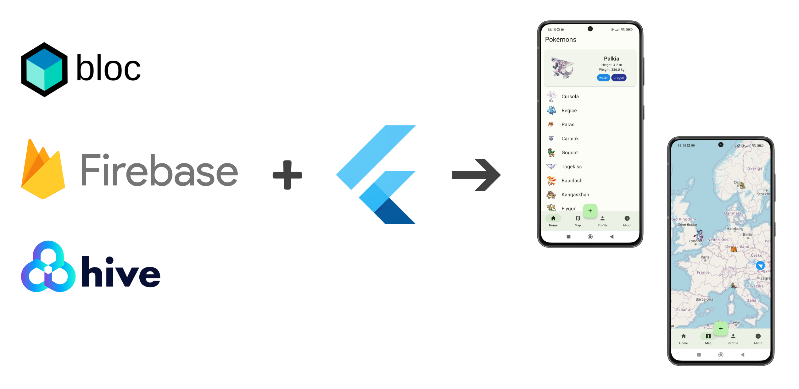

# PokéMap

This Flutter application was created as a part of my university course in Cross-Platform
Development. It showcases a map featuring randomly selected Pokémon and provides detailed
information about them in a dedicated view. To access the map, users are required to log in, and
this authentication process is managed through Firebase.

## Take a Peek

You can explore the application through the
following [link](https://marvelous-melba-2a655f.netlify.app/#/).
To log in, please use the provided credentials:

* Email: **`user@gmail.com`**
* Password: **`123456`**

# Technical Details

* **Architectural Foundation:** The app is designed following the Bloc pattern.
* **Local Data Storage:** Hive is employed to locally store the Pokémon data.
* **Authentication:** Firebase is used for authentication.
* **Maps:** The map is provided by openstreetmap and makes use of
  this [package](https://pub.dev/packages/flutter_map).
* **User Interface:** The app uses Material Design 3.

#### Credits

<a href="https://www.flaticon.com/de/kostenlose-icons/pokemon" title="pokémon Icons">Pokémon Icons
erstellt von Freepik - Flaticon</a>